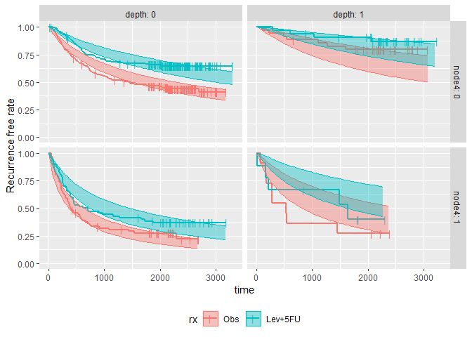

<!-- README.md is generated from README.Rmd. Please edit that file -->

# survParamSim

[](https://github.com/yoshidk6/survParamSim/actions)
[](https://cran.r-project.org/package=survParamSim)
[](https://CRAN.R-project.org/package=survParamSim)

The goal of survParamSim is to perform survival simulation with
parametric survival model generated from ‘survreg’ function in
‘survival’ package. In each simulation, coefficients are resampled from
variance-covariance matrix of parameter estimates, in order to capture
uncertainty in model parameters.

## Installation

You can install the package from CRAN.

``` r
install.packages("survParamSim")
```

Alternatively, you can install the development version from GitHub.

``` r
# install.packages("devtools")
devtools::install_github("yoshidk6/survParamSim")
```

## Example

[This GitHub pages](https://yoshidk6.github.io/survParamSim/) contains
function references and
[vignette](https://yoshidk6.github.io/survParamSim/articles/survParamSim.html).
The example below is a sneak peek of example outputs.

First, run survreg to fit parametric survival model:

``` r
library(dplyr)
#> 
#> Attaching package: 'dplyr'
#> The following objects are masked from 'package:stats':
#> 
#>     filter, lag
#> The following objects are masked from 'package:base':
#> 
#>     intersect, setdiff, setequal, union
library(ggplot2)
library(survival)
library(survParamSim)

set.seed(12345)

# ref for dataset https://vincentarelbundock.github.io/Rdatasets/doc/survival/colon.html
colon2 <- 
  as_tibble(colon) %>% 
  # recurrence only and not including Lev alone arm
  filter(rx != "Lev",
         etype == 1) %>% 
  # Same definition as Lin et al, 1994
  mutate(rx = factor(rx, levels = c("Obs", "Lev+5FU")),
         depth = as.numeric(extent <= 2))
```

``` r
fit.colon <- survreg(Surv(time, status) ~ rx + node4 + depth, 
                     data = colon2, dist = "lognormal")
```

Next, run parametric bootstrap simulation:

``` r
sim <- 
  surv_param_sim(object = fit.colon, newdata = colon2, 
                 censor.dur = c(1800, 3000),
                 # Simulating only 100 times to make the example go fast
                 n.rep = 100)

sim
#> ---- Simulated survival data with the following model ----
#> survreg(formula = Surv(time, status) ~ rx + node4 + depth, data = colon2, 
#>     dist = "lognormal")
#> 
#> * Use `extract_sim()` function to extract individual simulated survivals
#> * Use `calc_km_pi()` function to get survival curves and median survival time
#> * Use `calc_hr_pi()` function to get hazard ratio
#> 
#> * Settings:
#>     #simulations: 100 
#>     #subjects: 619 (without NA in model variables)
```

Calculate survival curves with prediction intervals:

``` r
km.pi <- calc_ave_km_pi(sim, trt = "rx", group = c("node4", "depth"))

km.pi
#> ---- Simulated and observed (if calculated) survival curves ----
#> * Use `extract_km_pi()` to extract prediction intervals of K-M curves
#> * Use `plot_km_pi()` to draw survival curves
#> 
#> * Settings:
#>     trt: rx 
#>     group: node4 
#>     pi.range: 0.95 
#>     calc.obs: TRUE 
#>     method: Average survival using `calc_ave_km_pi()`
plot_km_pi(km.pi) +
  theme(legend.position = "bottom") +
  labs(y = "Recurrence free rate") +
  expand_limits(y = 0)
```



``` r
# extract_medsurv_pi(km.pi)
```

Calculate hazard ratios with prediction intervals:

``` r
hr.pi <- calc_ave_hr_pi(sim, trt = "rx", group = c("depth"))

hr.pi
#> ---- Simulated and observed (if calculated) hazard ratio ----
#> * Use `extract_hr_pi()` to extract prediction intervals and observed HR
#> * Use `extract_hr()` to extract individual simulated HRs
#> * Use `plot_hr_pi()` to draw histogram of predicted HR
#> 
#> * Settings:
#>     trt: rx
#>          ('Lev+5FU' as test trt, 'Obs' as control)
#>     group: depth 
#>     pi.range: 0.95 
#>     calc.obs: TRUE 
#>     method: average HR using `calc_ave_hr_pi()`
plot_hr_pi(hr.pi)
```


``` r
extract_hr_pi(hr.pi)
#> # A tibble: 8 × 5
#>   depth rx      description    HR quantile
#>   <dbl> <fct>   <chr>       <dbl>    <dbl>
#> 1     0 Lev+5FU pi_low      0.487   0.0250
#> 2     0 Lev+5FU pi_med      0.609   0.5   
#> 3     0 Lev+5FU pi_high     0.761   0.975 
#> 4     0 Lev+5FU obs         0.590  NA     
#> 5     1 Lev+5FU pi_low      0.408   0.0250
#> 6     1 Lev+5FU pi_med      0.550   0.5   
#> 7     1 Lev+5FU pi_high     0.780   0.975 
#> 8     1 Lev+5FU obs         0.607  NA
```
