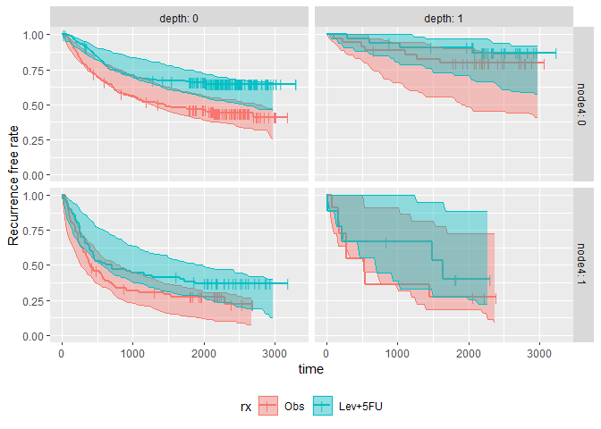

<!-- README.md is generated from README.Rmd. Please edit that file -->
survParamSim
============

[](https://travis-ci.org/yoshidk6/survParamSim)

The goal of survParamSim is to perform survival simulation with parametric survival model generated from 'survreg' function in 'survival' package.

Outputs include prediction intervals of Kaplan-Meier estimates and hazard ratio of treatment effect. You can also access raw simulated survival profiles of each simulation for post-processing.

In each simulation, coefficients are resampled from variance-covariance matrix of parameter estimates to capture uncertainty in model parameters.

Installation
------------

You can install the package from GitHub using **devtools**.

``` r
install.packages("devtools")
devtools::install_git("https://github.com/yoshidk6/survParamSim")
```

Example
-------

This is a basic example which shows you how to solve a common problem.

First, run survreg to fit parametric survival model:

``` r
library(dplyr)
library(ggplot2)
library(survival)
library(survParamSim)

set.seed(12345)

# ref for dataset https://vincentarelbundock.github.io/Rdatasets/doc/survival/colon.html
colon2 <- 
  as_tibble(colon) %>% 
  # recurrence only and not including Lev alone arm
  filter(rx != "Lev",
         etype == 1) %>% 
  # Same definition as Lin et al, 1994
  mutate(rx = factor(rx, levels = c("Obs", "Lev+5FU")),
         depth = as.numeric(extent <= 2))
```

``` r
fit.colon <- survreg(Surv(time, status) ~ rx + node4 + depth, 
                     data = colon2, dist = "lognormal")

summary(fit.colon)
#> 
#> Call:
#> survreg(formula = Surv(time, status) ~ rx + node4 + depth, data = colon2, 
#>     dist = "lognormal")
#>               Value Std. Error     z       p
#> (Intercept)  7.5103     0.1343 55.92 < 2e-16
#> rxLev+5FU    0.7606     0.1677  4.54 5.7e-06
#> node4       -1.3474     0.1816 -7.42 1.2e-13
#> depth        1.1243     0.2661  4.22 2.4e-05
#> Log(scale)   0.6040     0.0461 13.10 < 2e-16
#> 
#> Scale= 1.83 
#> 
#> Log Normal distribution
#> Loglik(model)= -2561.7   Loglik(intercept only)= -2607.6
#>  Chisq= 91.8 on 3 degrees of freedom, p= 9e-20 
#> Number of Newton-Raphson Iterations: 4 
#> n= 619
```

Next, run parametric bootstrap simulation:

``` r
sim <- surv_param_sim(object = fit.colon, newdata = colon2, 
                      # Simulating only 100 times to make the example go fast
                      n.rep = 100)

sim
#> ---- Simulated survival data with the following model ----
#> survreg(formula = Surv(time, status) ~ rx + node4 + depth, data = colon2, 
#>     dist = "lognormal")
#> 
#> * Use `extract_sim()` function to extract individual simulated survivals
#> * Use `calc_km_pi()` function to get survival curves and median survival time
#> * Use `calc_hr_pi()` function to get hazard ratio
#> 
#> * Settings:
#>     #simulations: 100 
#>     #subjects: 619 (without NA in model variables)
```

Calculate survival curves with prediction intervals:

``` r
km.pi <- calc_km_pi(sim, trt = "rx")

km.pi
#> ---- Simulated and observed (if calculated) survival curves ----
#> * Use `extract_median_surv()` to extract median survival times
#> * Use `extract_km_pi()` to extract prediction intervals of K-M curves
#> * Use `plot_km_pi()` to draw survival curves
#> 
#> * Settings:
#>     trt: rx 
#>     group: (NULL) 
#>     pi.range: 0.95 
#>     calc.obs: TRUE
plot_km_pi(km.pi) +
  theme(legend.position = "bottom") +
  labs(y = "Recurrence free rate") +
  expand_limits(y = 0)
```


Plot can be made for subgroups.
You can see that prediction interval is wide for depth: 1 and nodes4: 1 group, mainly due to small number of subjects

``` r
km.pi <- calc_km_pi(sim, trt = "rx", group = c("node4", "depth"))

plot_km_pi(km.pi) +
  theme(legend.position = "bottom") +
  labs(y = "Recurrence free rate") +
  expand_limits(y = 0)
```



Calculate hazard ratios with prediction intervals:

You can again see the wide prediction interval for depth: 1 and nodes4: 1 group

``` r
hr.pi <- calc_hr_pi(sim, trt = "rx", group = c("node4", "depth"))

hr.pi
#> ---- Simulated and observed (if calculated) hazard ratio ----
#> * Use `extract_hr_pi()` to extract prediction intervals and observed HR
#> * Use `extract_hr()` to extract individual simulated HRs
#> * Use `plot_hr_pi()` to draw histogram of predicted HR
#> 
#> * Settings:
#>     trt: rx
#>          (Lev+5FU as test trt, Obs as control)
#>     group: node4 
#>     pi.range: 0.95 
#>     calc.obs: TRUE
plot_hr_pi(hr.pi)
```


