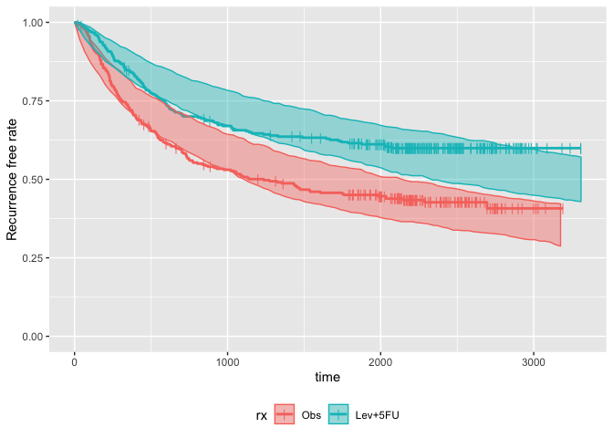
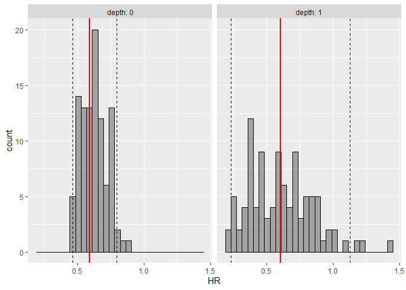

<!-- README.md is generated from README.Rmd. Please edit that file -->
survParamSim
============

[](https://travis-ci.org/yoshidk6/survParamSim)

The goal of survParamSim is to perform survival simulation with parametric survival model generated from 'survreg' function in 'survival' package.

Outputs include prediction intervals of Kaplan-Meier estimates and hazard ratio of treatment effect. You can also access raw simulated survival profiles of each simulation for post-processing.

In each simulation, coefficients are resampled from variance-covariance matrix of parameter estimates to capture uncertainty in model parameters.

Installation
------------

You can install the package from GitHub using **devtools**.

``` r
install.packages("devtools")
devtools::install_git("https://github.com/yoshidk6/survParamSim")
```

Example
-------

This is a basic example which shows you how to solve a common problem.

First, run survreg to fit parametric survival model:

``` r
library(survival)
library(survParamSim)

set.seed(12345)

fit.lung <- survreg(Surv(time, status) ~ sex, data = lung)

fit.lung
#> Call:
#> survreg(formula = Surv(time, status) ~ sex, data = lung)
#> 
#> Coefficients:
#> (Intercept)         sex 
#>    5.488584    0.395578 
#> 
#> Scale= 0.755088 
#> 
#> Loglik(model)= -1148.7   Loglik(intercept only)= -1153.9
#>  Chisq= 10.4 on 1 degrees of freedom, p= 0.00126 
#> n= 228
```

Next, run parametric bootstrap simulation:

``` r
# Remove a few subjects for later plotting purpose
newdata <- 
  lung %>% 
  dplyr::filter(!is.na(ph.ecog), ph.ecog <= 2)

sim <- surv_param_sim(object = fit.lung, newdata = newdata, 
                      # Simulating only 100 times to make the example go fast
                      n.rep = 100)

sim
#> ---- Simulated survival data with the following model ----
#> survreg(formula = Surv(time, status) ~ sex, data = lung)
#> 
#> * Use `extract_sim()` function to extract individual simulated survivals
#> * Use `calc_km_pi()` function to get survival curves and median survival time
#> * Use `calc_hr_pi()` function to get hazard ratio
#> 
#> * Settings:
#>     #simulations: 100 
#>     #subjects: 226 (without NA in model variables)
```

Calculate survival curves with prediction intervals

``` r
km.pi <- calc_km_pi(sim, trt = "sex", group = c("ph.ecog"))

km.pi
#> ---- Simulated and observed (if calculated) survival curves ----
#> * Use `extract_median_surv()` to extract median survival times
#> * Use `extract_km_pi()` to extract prediction intervals of K-M curves
#> * Use `plot_km_pi()` to draw survival curves
#> 
#> * Settings:
#>     trt: sex 
#>     group: ph.ecog 
#>     pi.range: 0.95 
#>     calc.obs: TRUE
plot_km_pi(km.pi) +
  ggplot2::theme(legend.position = "bottom")
```



Calculate hazard ratios with prediction intervals:

``` r
hr.pi <- calc_hr_pi(sim, trt = "sex", group = c("ph.ecog"))

hr.pi
#> ---- Simulated and observed (if calculated) hazard ratio ----
#> * Use `extract_hr_pi()` to extract prediction intervals and observed HR
#> * Use `extract_hr()` to extract individual simulated HRs
#> * Use `plot_hr_pi()` to draw histogram of predicted HR
#> 
#> * Settings:
#>     trt: sex
#>          (2 as test trt, 1 as control)
#>     group: ph.ecog 
#>     pi.range: 0.95 
#>     calc.obs: TRUE
plot_hr_pi(hr.pi)
```


